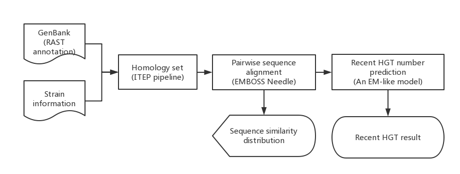

# RecentHGT

**Using an Expectation Maximization (EM) algorithm to detect recent horizontal gene transfer (HGT)
between bacterial species and strains.**

## Installation

The easiest way to use RecentHGT is to download the source code and unpack it.

You will also need install the other dependencies before running the script.

### Dependencies:
* Python 2.7 or 3.6
* BioPython
* R > 3.10
* ggplot2
* fitdistrplus
* [BLAST+ CLI](https://blast.ncbi.nlm.nih.gov/Blast.cgi?PAGE_TYPE=BlastDocs&DOC_TYPE=Download)
* [EMBOSS](http://emboss.sourceforge.net/)
* [pyani](https://github.com/widdowquinn/pyani)
* [ITEP](https://github.com/mattb112885/clusterDbAnalysis)

## Usage

### Input

#### Preparing a text file contains the information of all query strains
As shown in example_data directory, you need give these files before running:

* strain_info.txt

        No.   Strain  RastID  Chromosome  pSym
        1   IE4771	379.111	CP006986.1	CP006988.1

> Chromosome and symbiotic plasmid (pSym) were used in my research. So you can change 
these to other replicons or just delete them.
 
* [RAST](http://rast.nmpdr.org/) annotated genbank files located in genbank directory
#### Building the pan-genome

+ First, please follow the [tutorial](https://github.com/mattb112885/clusterDbAnalysis) of ITEP pipeline to build the pan-genome of your input genomes.
+ Then, you can use `fetch_pairwise_genome.py` located in `src/` directory to fetch all homologous genes of every strain pair. 
+ Putting all homologous genes every strain pair into a directory named `strain_pair_OG`.
+ Putting `strain_info.txt`, `strain_pair_OG` and `genbank` into a input directory.
       
### Running recentHGT

#### Pipeline


You can get a summary of available command-line options with `recentHGT.py -h`

```
$ python recentHGT.py -h
usage: average_nucleotide_identity.py [-h] [-o OUTDIRNAME] [-i INDIRNAME] 
                                      [-v VERBOSE] [-t THREADS] [-p PART]
                                      [-l LOGFILE] [-f FORCE] [--noclobber] 
                                      [-g DISPLAYFORMAT]
[…]
```
You can simply use this command to finish all steps automatically:
```
python recentHGT.py -i example_data -o example_out -v -l log.txt -p 0
```
Else, you can run each step by step respectively:
> Step 1: USing pyani program to calculate the ANI value of each strain pair.
```
python recentHGT.py -i example_data -o example_out -v -l log.txt -p 1
```
> Step 2: USing Needle program to do pairwise sequence alignment.
```
python recentHGT.py -i example_data -o example_out -v -l log.txt -p 2
```
> Step 3: Drawing similarity distribution pictures.
```
python recentHGT.py -i example_data -o example_out -v -l log.txt -p 3
```
> Step 4: Inferring the number of recent HGT genes.
```
python recentHGT.py -i example_data -o example_out -v -l log.txt -p 4
```
> Step 5: Drawing the comparison between the number of recent HGT genes and specific 
location genes (chromosome and plasmid genes).  
```
python recentHGT.py -i example_data -o example_out -v -l log.txt -p 5
```
### Output
> Step 1: There will be a directory named ANIm containing the output files from pyani program.

> Step 2: The alignment results will be packed `strain_pair_OG_alignment.tar.gz`

> Step 3: There will be two directories named `strain_pair_result` and `strain_result` separately.
>> `strain_pair_result` contains the pairwise alignment of each strain pair
>> `strain_result` contains the combination results for each query strain and the empirical distributions.

> Step 4: Estimated numbers of the recent HGT genes of all strain pairs will be saved 
in a text file named `recent_HGT_results.txt`.

> Step 5: A directory named `combined_results` will be output containing the pictures displaying the number of recent HGT genes 
and Chromosomal and Plasmid genes.


